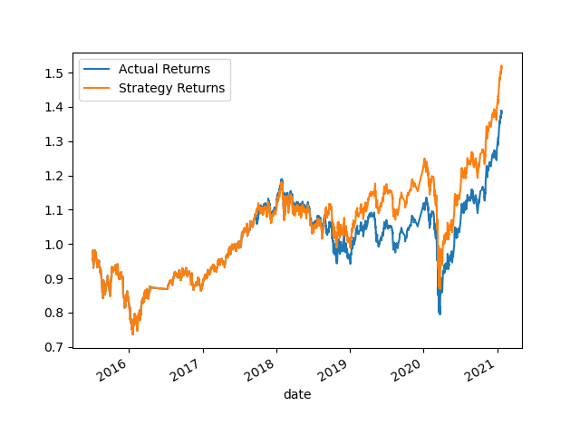

# Machine Learning Algorithmic Trading Bot

      This project involves the use of common machine learning models to create an algorithmic trading bot.

      In the sections below are the results of these bots. The first bot was created using SKLearn's support vector machine (SVM) learning method to fit the training data and make predictions based on testing data. For the second model, a logistic regression model was used to make predictions instead. Both of these model's performance was evaluated individually and against each other.

---- 

## First Trading Model
                    precision    recall  f1-score   support
      -1.0          0.43      0.04      0.07      1804        
      1.0           0.56      0.96      0.71      2288    
      
      accuracy                          0.55      4092 
      macro avg      0.49      0.50      0.39      4092
      weighted avg   0.50      0.55      0.43      4092

      As seen above, the first outpaced the actual returns. Starting in 2019, the strategy returns outpace the actual returns, although following the same trend and sentiment as actual returns. 

----

## Second Trading Model
              precision    recall  f1-score   support

        -1.0       0.44      0.33      0.38      1804
         1.0       0.56      0.66      0.61      2288

      accuracy                           0.52      4092
      macro avg       0.50      0.50      0.49      4092
      weighted avg       0.51      0.52      0.51      4092

As noticed above, the second model's final results diverge significantly compared to the actual returns. Nonetheless, the accuracy scores of this model were higher than the first model.

----

# Conclusion

      Overall the logistic regression's results were more accurate to the Actual Returns compared to the SVM model. Nonetheless, the SVM model's actual returns were higher in the long term as compared to the logistic regression. Both models were abotu 50% accurate in their predictions when compared to actual returns. 